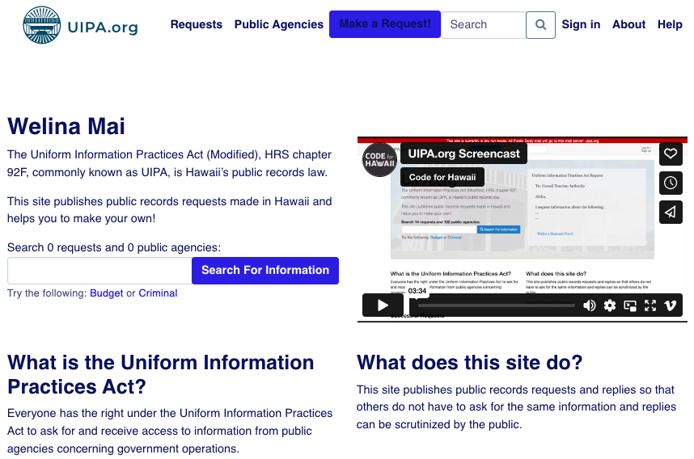

# Quick Start

## Running UIPA in a fully containerized environment

If you want to use the uipa containers, then you don't need to 
setup any prerequisites aside from installing docker or podman.

Then you can just run the following:

- `docker compose -f docker-compose.local.yml up` or `podman compose -f docker-compose.local.yml up`
- Wait a few minutes for everything to start running
- Open `http://127.0.0.1:8000/` in your web browser.

You can also define the follow environment variables for additional modifications to how
the containers run

|Variable | Effect                |
|---------|-----------------------|
| DEBUG | Enables debug output  |
| LOAD_DATA | Load seed data | 
| INITIALIZE_DB | Initialize Elasticsearch and Postgres Databases | 

## Running UIPA locally without a container

After setting up the prerequisites, run the following commands from the `uipa` directory in the working directory that you cloned the UIPA repository into.

- In a terminal window, run `docker-compose up`.
- In another terminal window, run:
    - `python -m venv venv`
    - `source venv/bin/activate`
    - `pip install -r requirements.txt`
    - `bash data/seed/init_db.sh`.
- In that same terminal window, run `python manage.py runserver`.
- Open `http://127.0.0.1:8000/` in your web browser.

# Getting Started

There are three main parts for developing UIPA.

1. The Database and Search Engine ([Elasticsearch](https://www.elastic.co/elasticsearch) & [PostgreSQL](https://www.postgresql.org/))
2. The Backend ([Django web server](https://www.djangoproject.com/))
3. The Frontend ([ViteJS](https://vitejs.dev/); pronounced like "veet")

## Prerequisites

Clone the UIPA repository to a working directory and change to the `uipa` directory created in your working directory.

```
git clone https://github.com/CodeWithAloha/uipa
cd uipa
```

For the purposes of this guide, you'll be running commands from this `uipa` directory.

Make sure that you have these installed:

- [Docker Desktop](https://docs.docker.com/engine/install/) (for the database and search engine)
- [Python 3.10](https://github.com/okfde/fragdenstaat_de/blob/21faa6893a582a02f2a96f4ccce96fddab13bec6/requirements.txt#L2) (for the backend server)

    > Note: You can use [pyenv](https://github.com/pyenv/pyenv) to manage your Python versions.

- PostgreSQL `psql` command line client (for Django admin `dbshell` support)

    > Note: Comes with a full PostgreSQL installation.

- GDAL (Geospatial Data Abstraction Library) (GIS support for PostgreSQL)

    > Note: You may need to set the GDAL_LIBRARY_PATH and/or GEOS_LIBRARY_PATH
    > environment variables in your shell environment. Remember to add export in front of the variable.

- [ImageMagick] (https://formulae.brew.sh/formula/imagemagick)

    > Note: You may need to set the MAGICK_HOME environment variables in your shell environment.
    > Remember to add export in front of the variable.

- [NodeJS & npm](https://nodejs.org/en/download) (for the frontend)
- [Yarn](https://classic.yarnpkg.com/en/docs/install) (for the frontend)

## One-time Set up

Do this once to get things ready to run the parts to develop UIPA.

### Database and Search Engine

The database and search engine are run together with one command using the provided [`docker-compose.yml`](https://github.com/CodeWithAloha/uipa/blob/08ce6d39bd9434f739117c801a7b8d442322455e/docker-compose.yml) file.

The first time that you run the command, it will build the required Docker images before running the Docker containers in your Docker Desktop.

After running `docker-compose up` successfully, the output in your terminal should look something like:


Type a `Ctl-C` (hold control key down and type the `C` key) to stop the `docker-compose` command.

### Frontend

Run these commands:

- `yarn install`
- `yarn build`

These commands do the following:
- Install ViteJS frontend JavaScript tooling.
- Install JavaScript dependencies.
- Build the frontend assets (JavaScript and CSS) for the development server.

### Backend

This assumes that your Python 3.10 installation is run with the `python` command. If your installation requires you to use `python3` instead, use that.

We're using a Python virtual environment created using the standard `venv` module. This isolates the dependencies for UIPA from any other Python work or project that you might have. In other words, it minimizes damage that might be caused from working with UIPA.

Run these commands:

- `python -m venv venv`
- `source venv/bin/activate`
- `pip install -r requirements.txt`
- `bash data/seed/init_db.sh`
- `python manage.py check`

These commands do the following:

- Set up a Python virtual environment in the working directory.
- Activate that Python virtual environment.
- Install the needed Python packages in the active Python virtual environment.
- Initialize the database.
- Create the search engine's indexes.
- Create an administrative user.
- Check that your Django development environment is set up correctly.

The administrative user is:
    ```
    Email address: admin@uipa.org
    Password:      secret007
    Username:      admin
    First name:    Adam
    Last name:     Ministrator
    ```
> CAUTION: Don't do this for any non-development server set-up.

### Frontend

Run these commands:

- `yarn install`
- `yarn build`

These commands do the following:
- Install ViteJS frontend JavaScrip tooling.
- Install JavaScript dependencies.
- Build the frontend assets (JavaScript and CSS) for the development server.

## Run the Backend

If you don't have it running in a termial window, start the database and search engine using `docker-compose up`.

In another terminal window, run the Django development web server using `python manage.py runserver`.

After starting the development web server, you should see something like this in your terminal:


At this point, you'll have at least two open terminal windows with servers running in them.

To stop the servers, type a `Ctl-C` (hold control key down and type the `C` key) in each terminal window running a server.

## Visit the dev website

Visit http://127.0.0.1:8000/ in your browser and you should see something like:

<picture>
 
</picture>


## Run the Frontend

The set up for the frontend created the assets that are needed for the development website to work without running the `ViteJS` frontend server. Also, the `Dev` configuration set in the `manage.py` file arranges things to use the created assets.

When you want to make changes to the JavaScript or CSS styling, then you'll need to switch to using the `ViteJS` frontend server.

To run the frontend server, you'll need to change the configuration for the backend. Do the following:
- Stop the backend server.
- Edit the `Dev` configuration in `uipa_org/settings/development.py` and comment out this line by inserting a '#' before it:
    ```
    FRONTEND_DEBUG = False
    ```
- Restart the backend server.

In another terminal window, run `yarn run serve`.

When running the frontend server, you'll have three terminal windows open. One each for the database/search engine, backend, and frontend.

To stop the servers, type a `Ctl-C` (hold control key down and type the `C` key) in each terminal window running a server.

The source for the frontend assets are found in the `frontend` directory.

